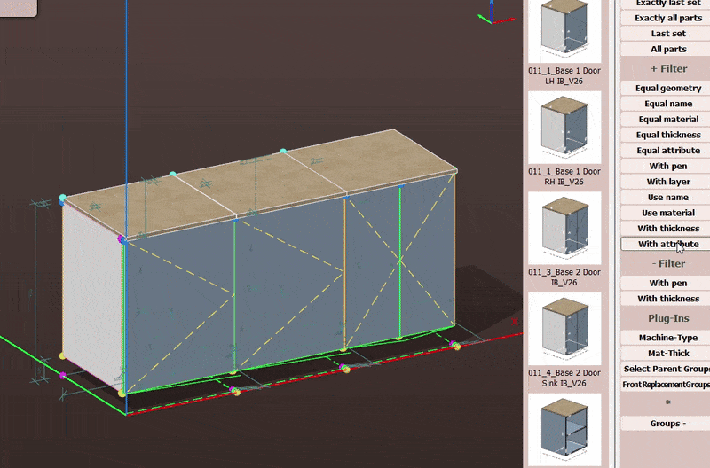

# ParentGroupSelector
Plugin for Pytha26 3D CAD software.

Adds two selectors: 
* Parent Group - Selects parent groups of the currently selected elements
* Front Names - Selects groups matching a given name
Adds one generator:
* Front Names - Enables adding names to the selection list available for Front Names selector

## Parent Group Selector

## Part Name Selector

